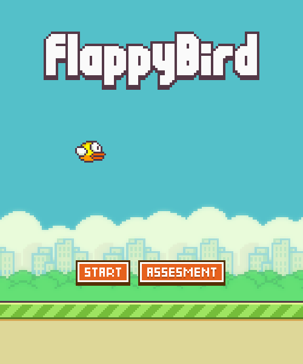

# Flappy Bird

I made this Flappy Bird rip off during highschool year 10 in 2021 from-scratch in **Pygame Zero**. This was my first coding project, so I got claude to go and compile it into an executable and push to a github repo. 

Assessment submission video from June 2021: https://youtu.be/HMhVcQ_2fFY

I did not even know what a for loop was at the time, so this took me about 900 lines of very unoptimised while loops.



## How to play

Guide the bird **Faby** through the pipes — every pair you pass scores a point. Faby
automatically descends and only ascends when you press **Space**. Hitting a pipe or
the ground ends the run. High scores earn medals: **bronze** at 10+, **silver** at 20+,
**gold** at 30+, **platinum** at 40+.

- **Space** — flap (and start the game on the "get ready" screen)
- **Mouse** — navigate the menus
- **Pause** button — top-left of the screen during play
- Includes an **Endless mode** and an **Assessment mode** with progressive levels

## Download the compiled game

Windows and macOS builds are attached to the [Releases](https://github.com/Finn-Gaughan/flappy-bird/releases) page:

| Platform | File |
| -------- | ---- |
| Windows  | `FlappyBird.exe` |
| macOS    | `FlappyBird-mac.zip` (contains `FlappyBird.app`) |

The executables are produced automatically by GitHub Actions, so they always match
the latest committed source.

## Run from source

```bash
pip install -r requirements.txt
python launcher.py
```

Requires Python 3.8+ (the game was written against Python 3 / Pygame Zero 1.x).

## Assignment specification

*From the original high school write-up.*

> Flappy Bird is an arcade-style game in which the player controls the bird Faby,
> which moves persistently to the right. The player is tasked with navigating Faby
> through pairs of pipes that have equally sized gaps placed at random heights. Faby
> automatically descends and only ascends when the player presses the spacebar. Each
> successful pass through a pair of pipes awards the player one point. Colliding with
> a pipe or the ground ends the gameplay. During the game over screen, the player is
> awarded a bronze medal if they reached ten or more points, a silver medal from
> twenty points, a gold medal from thirty points, and a platinum medal from forty
> points.

### Success criteria

- A Complete and Function Flappy Bird Remake
- An Assessment Mode with at least 2 Levels
- Collectable Medals for each high-score in increments of 10
- An Infinite Endless mode
- Hard Difficulty but still skill-based
- A Custom-made gravity system
- Original Sound Effects


